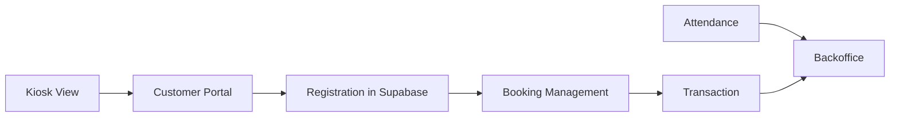

# 10. Island Architecture

This document explains the current product split into separate islands and how users move between them.

## 10.1 Why Islands

The project now separates product surfaces by job instead of keeping everything inside one overloaded dashboard.

Each island has:

- a clear user type
- a narrower objective
- a clearer route entry point
- fewer unrelated controls on screen at once

## 10.2 Current Island List

### Island 1: Customer Portal

Purpose:

- Public discovery and booking
- Customer-first experience

Primary users:

- customers
- social traffic
- returning customers from booking links and social handoff

Routes:

- customer portal `/`
- customer portal `/booking`
- customer portal `/photobooth`

Primary files:

- `apps/customer-portal/src/components/LandingPage.tsx`
- `apps/customer-portal/src/components/BookingFlow.tsx`
- `apps/customer-portal/src/components/PhotoboothPage.tsx`

Output to the rest of the system:

- creates `registrations` in Supabase

### Island 2: POS Dashboard / Booking Management

Purpose:

- Operate the selected day
- view per-studio schedule
- verify bookings
- open sessions
- handle transaction flow

Primary users:

- front desk crew
- studio operators

Route:

- pos dashboard `/booking-management`

Primary files:

- `apps/pos-dashboard/src/components/POSBoard.tsx`
- `apps/pos-dashboard/src/components/POSGateway.tsx`

Output to the rest of the system:

- updates `registrations`
- creates and updates `transactions`

### Island 3: Attendance + Finance

Purpose:

- crew attendance
- payroll view
- omzet tracking
- expenses tracking

Primary users:

- owner
- manager
- trusted crew

Route:

- pos dashboard `/backoffice`

Primary files:

- `apps/pos-dashboard/src/components/BackofficeIsland.tsx`
- `apps/pos-dashboard/src/components/AttendanceBoard.tsx`
- `apps/pos-dashboard/src/components/FinanceDashboard.tsx`
- `apps/pos-dashboard/src/components/FinanceGateway.tsx`

Output to the rest of the system:

- writes `attendance`
- reads `transactions`
- writes `expenses`

### Island 4: Kiosk View

Purpose:

- touch-friendly entry screen for tablets
- package selection and handoff into booking flow

Primary users:

- customers on studio tablets
- crew assisting customers

Route:

- pos dashboard `/kiosk`

Primary file:

- `apps/pos-dashboard/src/components/KioskView.tsx`

Output to the rest of the system:

- deep-links users into customer portal booking
- does not directly create bookings itself

## 10.3 Support Surfaces

There are also supporting internal surfaces that are not part of the main four-island model:

- `/tv`
  - TV display view
- `/os/dashboard`
  - alternate POS layout route

## 10.4 Route Ownership

The two apps do not share a single router.

Customer portal owns:

- public browsing and booking

POS dashboard owns:

- internal island launcher and operations tools

## 10.5 Current Flow Between Islands

In words:

1. Customer Portal creates a registration.
2. Booking Management sees that registration and turns it into an active studio session.
3. Session handling creates and finalizes transactions.
4. Finance reads paid transactions.
5. Attendance records feed payroll and staff ops.
6. Kiosk is a convenience handoff into booking, not a separate booking engine.

## 10.6 Current Implementation Nuances

### Root Route Behavior

Inside the internal POS app, `/` now opens the island hub.

That means:

- the internal root is no longer the booking board itself
- booking management lives at `/booking-management`

### Backoffice Migration State

There is now a dedicated `/backoffice` route.

However:

- some attendance and finance switching still exists inside `POSBoard.tsx`
- the preferred mental model is to use `/backoffice` for those workflows

### Portal Linking

The island hub links to the customer portal using `VITE_CUSTOMER_PORTAL_URL` when available.

Fallbacks:

- local dev: `http://localhost:3000`
- otherwise: `https://meraselfstudio.com`

## 10.7 Why This Matters for Development

When making changes, decide first which island owns the feature.

Use this rule:

1. Customer-facing booking or branding belongs in `apps/customer-portal`
2. Daily studio operations belong in booking management
3. Payroll, omzet, and expenses belong in backoffice
4. Tablet-assisted selection belongs in kiosk

That boundary helps avoid re-creating the original overloaded dashboard problem.