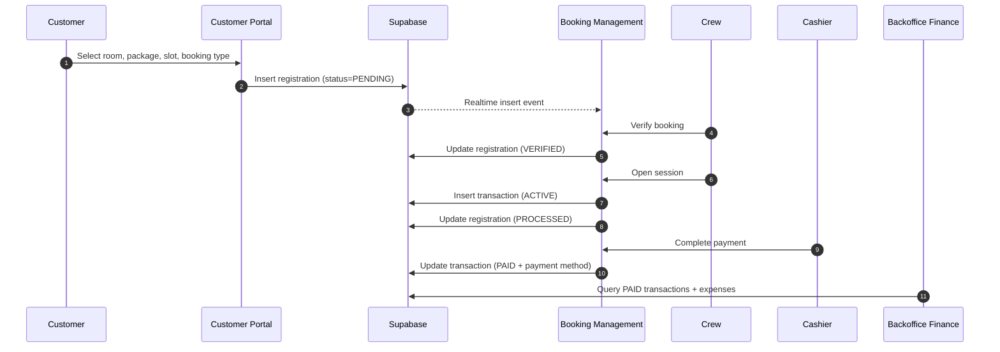
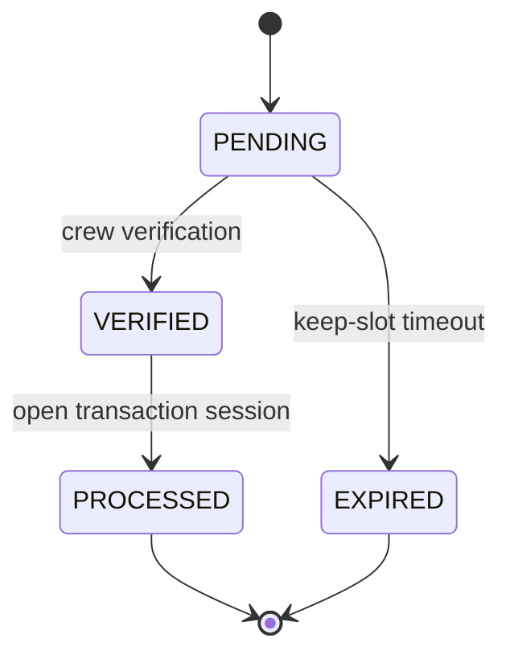
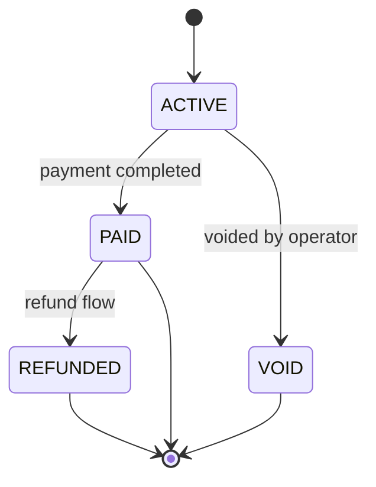
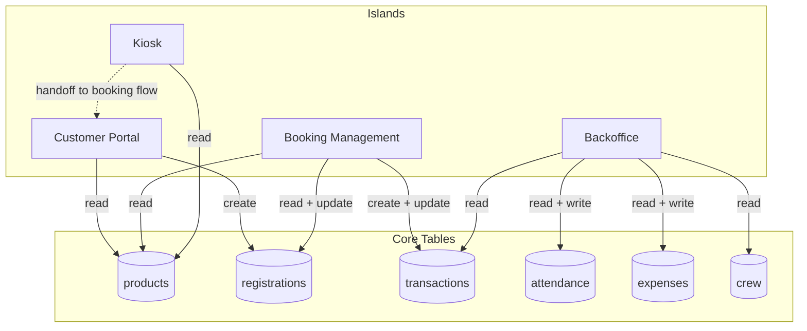
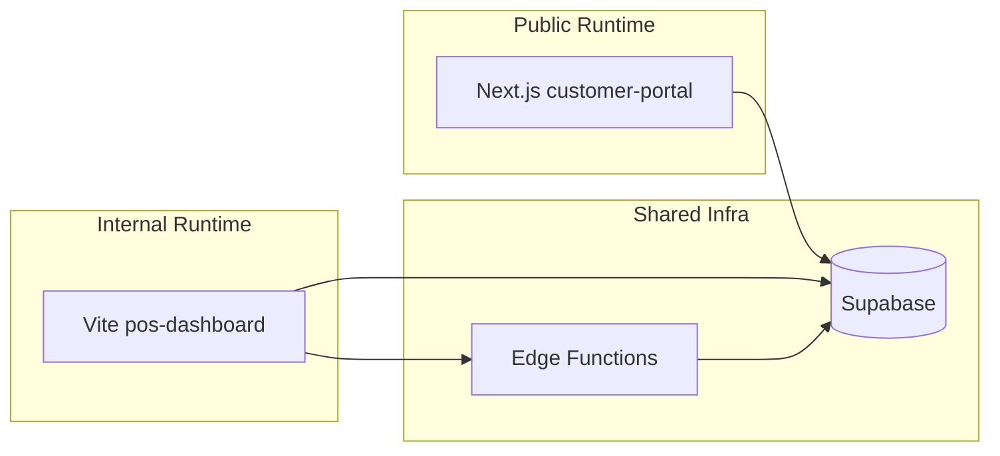

# 13. Visual System Map (Mermaid)

This is a visual handoff document for team onboarding and cross-functional communication.

Use these diagrams to quickly understand:

- what modules exist
- how users move between islands
- how booking and payment flow through the system
- which modules own which tables and state transitions

## 13.1 Landscape Map

```mermaid
flowchart LR
    subgraph Public[Customer Portal - Next.js]
        LP[Landing Page]
        BF[Booking Flow]
        PB[Photobooth]
    end

    subgraph Internal[POS Dashboard - Vite + React Router]
        IH[Island Hub /]
        BM[Booking Management /booking-management]
        BO[Backoffice /backoffice]
        KV[Kiosk /kiosk]
        TV[TV /tv]
    end

    subgraph Shared[Shared Workspace Packages]
        PS[@mera/supabase]
        PU[@mera/ui]
        PC[@mera/config]
    end

    subgraph Backend[Supabase Project]
        DB[(Postgres)]
        RT[Realtime]
        ST[Storage]
        EF[Edge Function calculate-payroll]
    end

    LP --> BF
    KV --> BF
    BF --> DB
    BM <--> DB
    BM <--> RT
    BO <--> DB
    BO --> EF
    BO --> ST

    PS --> BF
    PS --> BM
    PS --> BO
    PS --> KV
    PU --> BF
    PU --> BM
    PU --> BO
    PC --> BF
    PC --> BM
    PC --> BO

    PB -. client-only capture .- PB
    TV --> DB
```

## 13.2 Island Navigation Map

```mermaid
flowchart TD
    A[Internal App Root /] --> B[Island Hub]

    B --> C[Customer Portal]
    B --> D[Booking Management]
    B --> E[Attendance + Finance]
    B --> F[Kiosk View]
    B --> G[TV Dashboard]

    C --> C1[/]
    C --> C2[/booking]
    C --> C3[/photobooth]

    D --> D1[/booking-management]
    E --> E1[/backoffice]
    F --> F1[/kiosk]
    G --> G1[/tv]
```

## 13.3 Booking to Payment Sequence



## 13.4 Registration and Transaction State Machines

### Registration



### Transaction



## 13.5 Data Ownership Map



## 13.6 Runtime and Deployment View



## 13.7 How to Use This in Handoff

For onboarding a new developer:

1. Start at section 13.1 and 13.2
2. Then read section 13.3 for lifecycle behavior
3. Use section 13.4 to reason about status transitions
4. Use section 13.5 before changing table writes

For PM or ops discussion:

1. Use section 13.2 to align module boundaries
2. Use section 13.3 to discuss operational bottlenecks
3. Use section 13.6 to explain runtime separation

## 13.8 Companion Docs

Read together with:

- [9-current-project-context.md](./9-current-project-context.md)
- [10-island-architecture.md](./10-island-architecture.md)
- [11-core-business-logic.md](./11-core-business-logic.md)
- [12-development-reference.md](./12-development-reference.md)